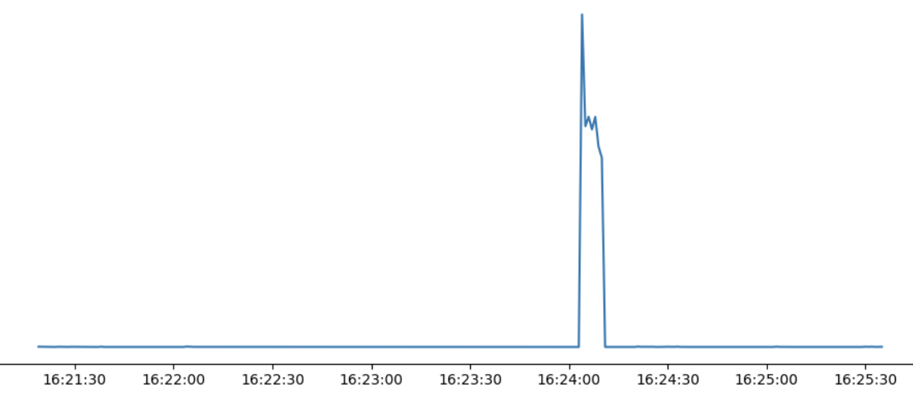
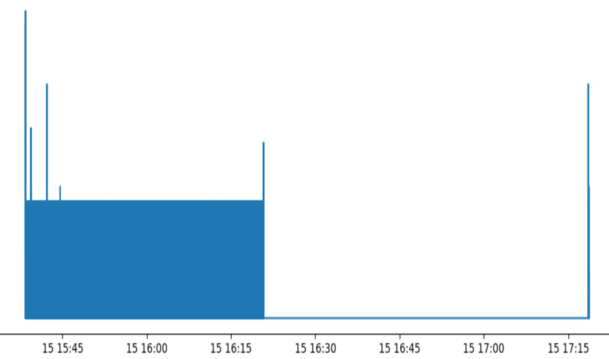

# Wireshark Traffic Analysis

I analysed two packet captures from a lab network in Wireshark. For each one I worked out what the attacker did, which packets show it and how it could have been stopped, then mapped each finding to MITRE ATT&CK.

I'm aiming for a SOC analyst role, and a big part of that job is looking at traffic and deciding what actually happened rather than just trusting an alert. This was practice at going from raw packets to a timeline someone else could act on.

## Summary

In PCAP 1, a machine at `192.168.56.104` checks the target is online (ARP, then ping) and then runs a SYN port scan against it.

In PCAP 2, a machine at `192.168.56.1` spends about 40 minutes guessing FTP passwords for one account. An hour later it logs in with the right password and downloads a file called `Confidential Information.doc`.

The target in both captures is `192.168.56.101`, which runs a web server and a vsFTPd 2.0.7 FTP server.

## Findings

| # | Capture | What happened | Type | Packets | From → To | MITRE ATT&CK |
|---|---|---|---|---|---|---|
| 1 | PCAP 1 | ARP request to find the target's MAC address | Suspicious | 68–69 | .104 → .101 | T1018 Remote System Discovery |
| 2 | PCAP 1 | Ping to check the target is online | Suspicious | 70–75 | .104 → .101 | T1018 Remote System Discovery |
| 3 | PCAP 1 | TCP SYN port scan | Malicious | 94–48258 | .104 → .101 | T1046 Network Service Discovery |
| 4 | PCAP 2 | FTP username and password sent in plain text | Security weakness | 15–21 | .102 → .101 | Makes T1040 Network Sniffing possible |
| 5 | PCAP 2 | FTP password guessing (brute force) | Malicious | 105 onwards | .1 → .101 | T1110.001 Password Guessing |
| 6 | PCAP 2 | Commands sent far faster than a person could type | Suspicious | 105 onwards | .1 → .101 | Part of T1110.001 |
| 7 | PCAP 2 | Logs in with the correct password and downloads a confidential file | Malicious | 14209–14232 | .1 → .101 | T1078 Valid Accounts, T1048.003 Exfiltration Over Unencrypted Non-C2 Protocol |

Full write-ups:

- [PCAP 1: reconnaissance and port scan](findings/pcap1-reconnaissance.md)
- [PCAP 2: FTP brute force and data theft](findings/pcap2-ftp-attack.md)
- [Wireshark filters I used](wireshark-filters.md)

## Packet rate

I plotted packets per second for both captures in Python. Both attacks are obvious once you see them over time.

| PCAP 1: port scan spike (about 7 seconds) | PCAP 2: long period of password guessing |
|---|---|
|  |  |

## How it could have been stopped

- Port scans: close ports that aren't needed, rate-limit connection attempts on the firewall, and have an IDS alert on scan patterns
- Plain-text FTP: replace it with SFTP or FTPS
- Password guessing: block an IP after a few failed logins (fail2ban does this), enforce strong passwords, and alert when one IP racks up lots of `530 Login incorrect` replies
- The confidential file: it shouldn't have been on an FTP server in the first place, and file permissions should have been much tighter

## How I worked through it

I started with the graphs rather than the packets. PCAP 1 has one sharp spike at about 16:24 that lasts a few seconds. PCAP 2 has a solid block of traffic from 15:38 to about 16:20, then almost nothing until a short burst at 17:18. That told me which time windows to look at before I opened a single packet.

From there I used display filters to zoom in. In PCAP 1, filtering for SYN packets without the ACK flag showed thousands of connection attempts from one host to one target. Then I worked backwards from the start of the scan to see what that host had done beforehand, which is where the ARP request and the pings came from. In PCAP 2, the FTP reply codes did most of the work: `530` for every failed guess, `230` for the login that worked, and `RETR` to see what was taken.

A few details convinced me I was reading it right. The scan SYNs only carry an MSS option, and their window size keeps switching between 1024, 2048, 3072 and 4096. A normal client looks nothing like that. The FTP client at .102, for example, sends a window of 5840 with SACK and timestamp options. Those four window sizes are a known Nmap SYN scan signature, and public IDS rule sets match on them. The ports go up in order, though, and Nmap randomises them by default, so I'd only go as far as calling it Nmap-like.

Every MAC address in both captures starts with 08:00:27, which Wireshark shows as PCSSystemtec. That's the range VirtualBox uses, so this is a host-only lab network, and .1 (the attacker in PCAP 2) is the host computer itself.

The file transfer also lines up exactly. Before the download the server replies `227 Entering Passive Mode (192,168,56,101,61,163)`. The last two numbers give the data port: 61 × 256 + 163 = 15779. The attacker then sends `RETR` and connects to port 15779, and that connection carries the file.

One thing I can't settle from the capture alone: the guessing stops at about 16:20, but the successful login isn't until 17:18, and the password that worked is the same one .102 sent in plain text at 15:38. So the attacker either guessed it eventually or sniffed it off the network. Either way the fix is the same: stop using plain-text FTP.