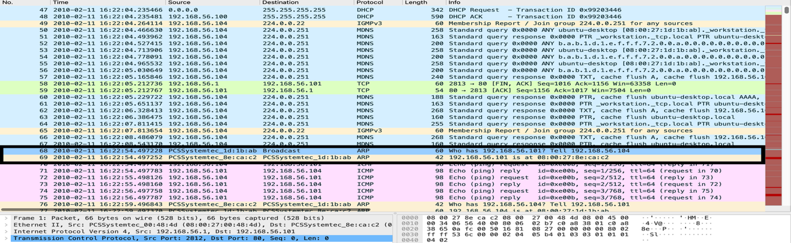
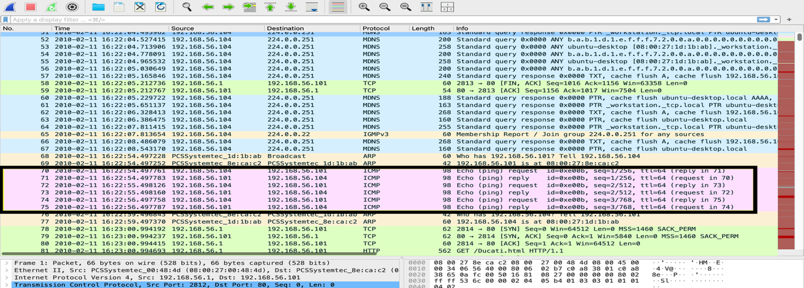
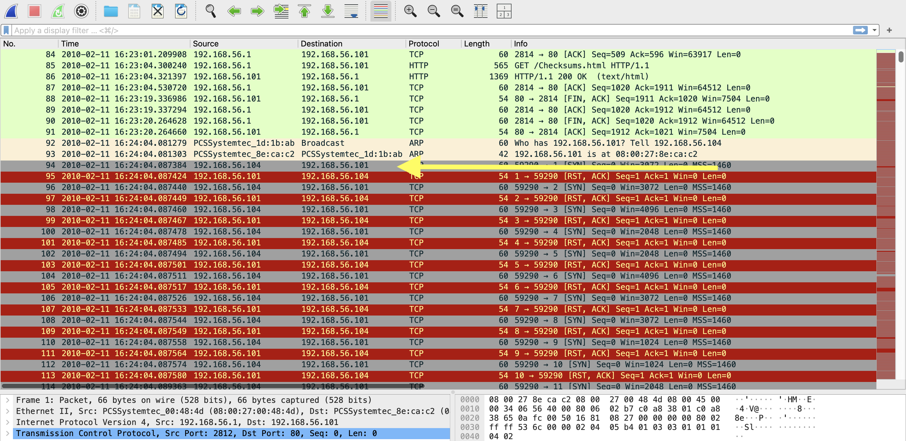
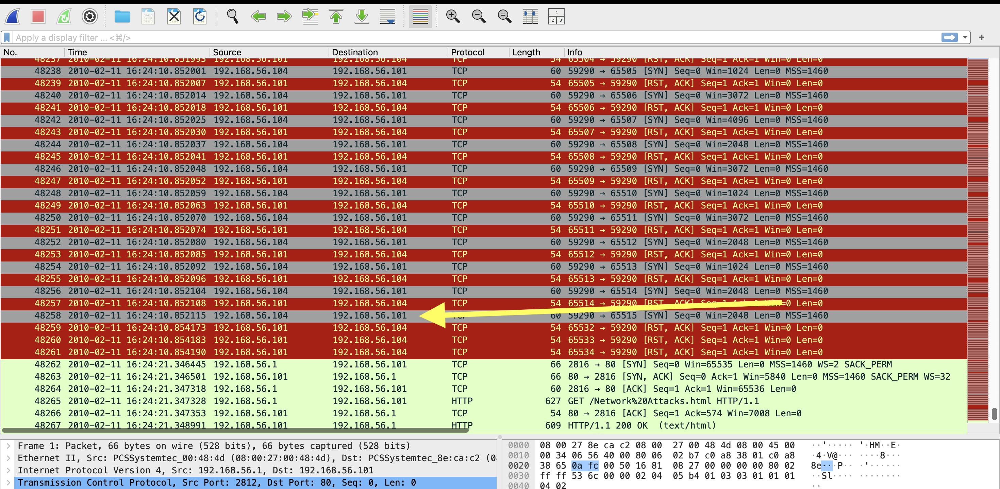

# PCAP 1: Reconnaissance and Port Scan

Attacker: `192.168.56.104`
Target: `192.168.56.101`
Date in the capture: 11 Feb 2010

## What happened, in order

| Time | Packets | Event |
|---|---|---|
| 16:22:54 | 68–69 | .104 sends an ARP request for .101 and gets its MAC address |
| 16:22:54 to 16:22:56 | 70–75 | .104 pings .101 and gets replies, so it knows the target is up |
| 16:24:04 | 92–93 | Another ARP request for the target, 6 ms before the scan starts |
| 16:24:04 | 94 | SYN port scan starts |
| 16:24:10 | 48258 | Scan ends, roughly 48,000 packets in about 7 seconds |

On their own, ARP and ping are completely normal. I only flagged them because of what came next: find the MAC, check the host is up, then scan it. That's what reconnaissance looks like.

## ARP and ping (suspicious)

I found these by working backwards from the start of the scan and looking at what .104 had done in the minutes before. The ARP request asks who has 192.168.56.101, and the pings confirm it's online before the attacker spends time scanning it.

The second ARP request at packets 92–93 is the interesting one. It comes 6 ms before the first SYN, which fits a scanning tool resolving the target's MAC itself right before it starts sending its own packets. Nmap does this when the target is on the same local network.

Filters I used: `arp.opcode == 1 && arp.src.proto_ipv4 == 192.168.56.104` and `icmp.type == 8 && ip.src == 192.168.56.104`

Neither of these is worth blocking on its own. What would help is correlating them with other signs of scanning, plus Dynamic ARP Inspection and proper segmentation so an attacker can't map the network this easily.

## The SYN scan (malicious)

Filtering on `ip.src == 192.168.56.104 && tcp.flags.syn == 1 && tcp.flags.ack == 0` shows the scan clearly:

- SYNs go to port 1, then 2, then 3, all the way up into the 65,5xx range, in about 7 seconds
- The source port stays at 59290 the whole time
- Closed ports answer with RST, ACK. Open ports answer with SYN, ACK, and the attacker never sends the final ACK, so the handshake is never completed

What made me sure a tool built these packets is the TCP header itself. The SYNs only carry an MSS option, and the window size keeps switching between 1024, 2048, 3072 and 4096. A normal operating system doesn't do that. The FTP client in PCAP 2, for comparison, sends a window of 5840 with SACK and timestamp options. Those four window sizes are a known Nmap signature, and public IDS rule sets have a rule for each one. Nmap randomises the port order by default, though, and these go up in order, so either it was run with `-r` or it's a similar tool.

To pull out just the crafted SYNs: `tcp.flags.syn == 1 && tcp.flags.ack == 0 && tcp.window_size_value in {1024 2048 3072 4096}`

| Start of the scan | End of the scan |
|---|---|
|  |  |

The scan found port 80 (HTTP) open, which is what the attacker would go after next. To defend against this: close ports that don't need to be open, have the firewall rate-limit how many ports one IP can hit in a short time, and use IDS rules that alert on scan patterns like these window sizes.