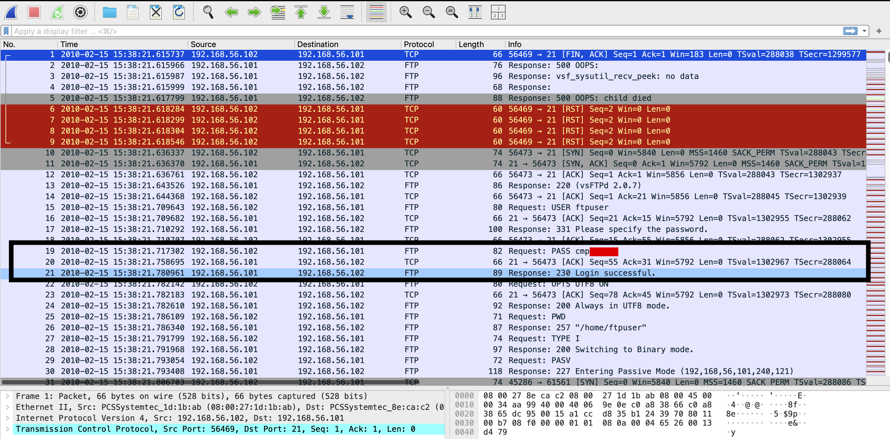
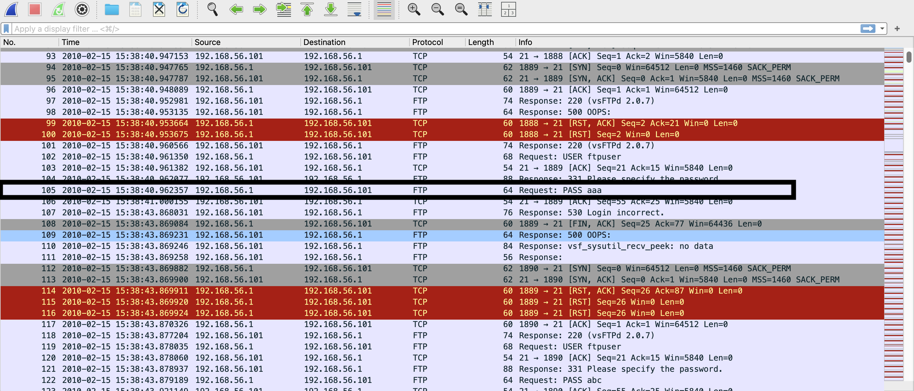
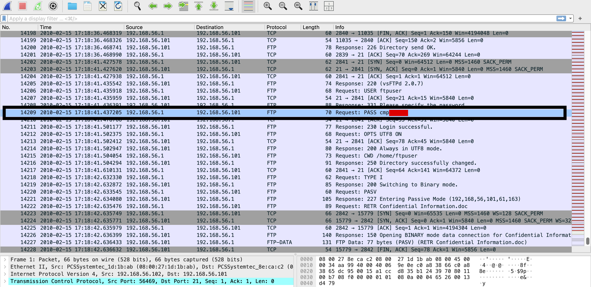
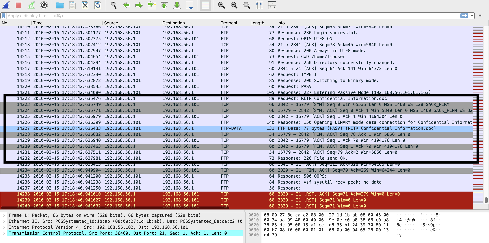

# PCAP 2: FTP Brute Force and Data Theft

Attacker: `192.168.56.1`
Target: `192.168.56.101` (vsFTPd 2.0.7)
Other client: `192.168.56.102`
Date in the capture: 15 Feb 2010

## What happened, in order

| Time | Packets | Event |
|---|---|---|
| 15:38:21 | 15–21 | .102 logs in as `ftpuser`, with the username and password readable in plain text |
| 15:38:40 | 105 | .1 starts guessing passwords for `ftpuser` (`aaa`, `abc` …), each one rejected with `530 Login incorrect` |
| 15:38 to about 16:20 | 105 onwards | Guessing carries on at machine speed |
| 17:18:41 | 14209–14211 | .1 sends the correct password and gets `230 Login successful` |
| 17:18:42 | 14222–14232 | .1 changes to `/home/ftpuser`, switches to binary mode and downloads `Confidential Information.doc` |

## Plain-text login (security weakness)

FTP doesn't encrypt anything, so anyone who can capture traffic on this network can read usernames and passwords. I found the .102 login with `ftp.request.command == "USER" || ftp.request.command == "PASS"`. It looks like a normal user logging in, so I've classed it as a weakness in the protocol rather than an attack. It matters, though, because the password in it is the same one the attacker uses to get in later. I've covered most of it in red (`cmp******`).

The fix is to turn off FTP and use SFTP or FTPS instead.

## Password guessing (malicious)

Filtering on `ftp.response.code == 530` shows the failed logins, and `ip.src == 192.168.56.1 && ftp.request.command == "PASS"` shows every password the attacker tried. It's one IP against one account, with new connections opening one after another and commands arriving far faster than anyone could type, so it's an automated tool. The graph in the README shows it as a solid block of traffic lasting about 40 minutes.

| First attempts | The login that worked (password partly covered) |
|---|---|
|  |  |

Blocking an IP after a handful of failed logins (fail2ban does this) would have stopped it early, and an alert on lots of `530` replies from one source would have flagged it within minutes.

## Login and download (malicious)

I used `ftp.response.code == 230` to find successful logins, `ftp.request.command == "RETR"` for downloads, and `ftp-data` for the transfer itself.

About a second after logging in, the attacker downloads `Confidential Information.doc`, which is 77 bytes and comes through in packet 14227. A login after about an hour of failed guesses, followed within a second by downloading a file called "Confidential", is data theft, not normal use.

The download also shows how FTP really works. Commands go over port 21, but files go over a separate data connection. Here the attacker sends `PASV`, and the server replies `227 Entering Passive Mode (192,168,56,101,61,163)`. The first four numbers are the server's IP, and the last two make the port: 61 × 256 + 163 = 15779. The attacker then sends `RETR` and connects to port 15779 (packet 14223), and the file comes through on that connection. That's why firewalls need FTP inspection to allow passive FTP, and why monitoring that only watches port 21 would see the `RETR` command but miss the file itself.

Sensitive files shouldn't be on an FTP server at all, and tighter file permissions would have limited what this account could reach. Alerting on a download straight after a burst of failed logins would have caught this too.

## What I couldn't prove

The guessing stops at about 16:20, but the successful login isn't until 17:18, almost an hour later. The password that worked is the same one .102 sent in plain text at 15:38. So either the attacker's tool found it, or they sniffed it off the network. The capture alone can't tell me which. In a real investigation I'd check every `230` reply in the capture and find out whether the attacker had access to that network segment, because the answer changes how far the incident might go.